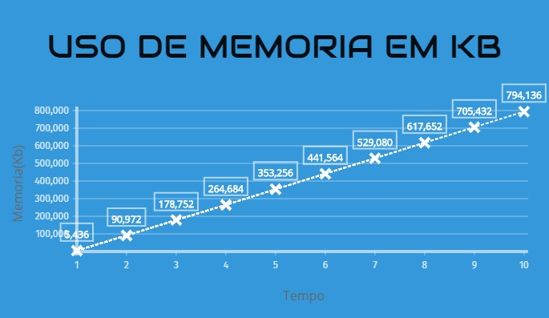

# Identificação

* Página do repositório do trabalho (<a href="https://github.com/etm1996/teaching/tree/master/2018.1-IAC/AB2.1-TP">GitHub</a>)

* Discente 1
	* Nome: Eduardo Tenório Monteiro
	* Matrícula: 18110628
* Discente 2
	* Nome: Luis Otávio S. de Oliveira
	* Matrícula: 17110133
* **Obs.: Dividir igualmente as notas.**

# Métodos de compilação e execução
 * Para compilação:
    * **gcc main.c -o main**

 * Para execução do código com utilização intensa da UCP:
    * **./main ucp**
 * Para execução do código com utilização intensa da UCP e da memória:
    * **./main ucp-mem**

# Resultados

Gráfico de consumo intenso da UCP (%):

Gráfico de consumo de memória (KB):

  

# Discussão

## Utilização intensa da UCP

TODO: explicar se o comportamento da curva **UCP** foi o esperado, sempre justificando sua resposta, referenciando o código fonte do programa e o gráfico do experimento realizado.

## Utilização intensa da UCP e memória

TODO: explicar se o comportamento da curva **UCP-MEM** foi o esperado, sempre justificando sua resposta, referenciando o código fonte do programa e o gráfico do experimento realizado.
